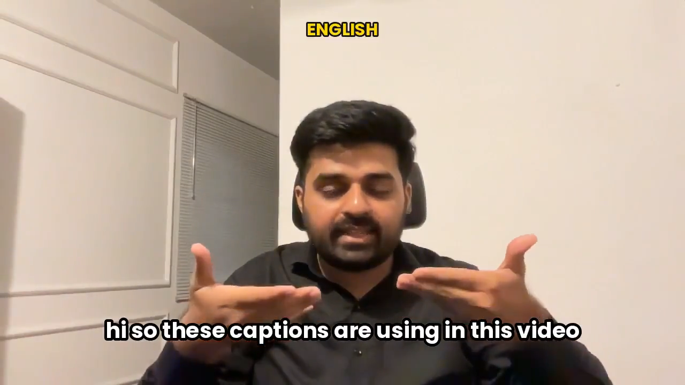

<p align="center">
  
</p>

<h1 align="center">agent-caption</h1>

<p align="center">
  Add captions to any video or song, in any language — <b>100% local, no cloud</b>.<br/>
  Hinglish-first · speech + music · forced-alignment timing · free · MIT · for any AI agent.
</p>

<p align="center">
  <a href="https://ahkamboh.github.io/agent-caption/"><b>🌐 Live site &amp; one-paste prompt →</b></a>
</p>

<p align="center">
       
</p>

<p align="center">
  <a href="https://github.com/ahkamboh/agent-caption/raw/master/assets/demo.mp4">
    
  </a>
  <br/>
  <sub>▶ One video, captioned in <b>11 languages</b> — 1100+ supported · speech &amp; songs · 100% on-device · <a href="https://github.com/ahkamboh/agent-caption/raw/master/assets/demo.mp4">click to play</a></sub>
</p>

---

## 🚀 Quick start

### With any AI coding agent
Works with **Claude Code · Cursor · GitHub Copilot · ChatGPT · Gemini · Grok** — or any other.

Open this folder in your agent and just say *“caption ./myvideo.mp4”*. Or paste this:

```
You are a captioning agent for the open-source repo github.com/ahkamboh/agent-caption.
Read its instructions — ./SKILL.md, or fetch the raw file:
https://raw.githubusercontent.com/ahkamboh/agent-caption/master/SKILL.md — and follow them exactly.
Goal: add accurate, perfectly-timed captions to the video/audio I give you,
in any language (default English; Hinglish supported), for speech AND music.

1. if ./.venv-whisperx isn't set up, run:  python setup.py
2. ask me for the file path (and language if not English)
3. caption it:  python caption.py <file>   (--hinglish, --content music,
   --style <name>, --glossary "...", --script lyrics.txt as needed)
4. show me the output path (<file>.captioned.mp4)
```

---

## ✅ Great for

| Use case | What you get |
|---|---|
| 🎙 **Podcasts & interviews** | accurate, clean word-by-word captions |
| 🗣 **Speech** — talking-head, UGC, explainers, courses, ads | tight, readable subtitles |
| 🎵 **Songs & lyric videos** | Demucs vocal isolation → clean lyrics |
| 📱 **TikTok · Reels · YouTube Shorts** | viral burned-in caption styles |
| 🌍 **Any language + Hinglish** | 99 languages, code-switch built in |
| ⏱ **Accurate word timestamps** | forced alignment → perfect `.srt` / `.vtt` |

---

## 🎛 Common options

Same command, add a flag:

| You want… | Add this |
|---|---|
| Hinglish / mixed Hindi-English | `--hinglish` |
| A song (isolate the vocals first) | `--content music` |
| A famous look | `--style hormozi` *(15 styles)* |
| A different language | `--lang ur` |
| Bigger / re-positioned | `--size 6 --pos center` |
| Names spelled right | `--glossary "Xaibridge, Kamboh"` |
| You already have the lyrics/script | `--script lyrics.txt` *(100% accurate words)* |
| Fix their/there, your/you're | `--grammar` |
| Just a subtitle file | `--srt` |
| Faster (lower accuracy) | `--fast` |
| Fail loudly if the output is broken | `--strict` |

---

## 🌍 Languages

| Capability | How many |
|---|---|
| **Recognize & caption** (Whisper) | **99 languages** |
| **Frame-accurate word timing** (whisperX) | **38 languages** |
| **Universal time-alignment** (MMS) | **1100+ languages** |
| **Default** | **English** |
| **Mixed / code-switch** | **Hinglish** + any |

**All 99 languages it can caption:**

| | | | | |
|---|---|---|---|---|
| Afrikaans | Albanian | Amharic | Arabic | Armenian |
| Assamese | Azerbaijani | Bashkir | Basque | Belarusian |
| Bengali | Bosnian | Breton | Bulgarian | Burmese |
| Cantonese | Catalan | Chinese | Croatian | Czech |
| Danish | Dutch | English | Estonian | Faroese |
| Finnish | French | Galician | Georgian | German |
| Greek | Gujarati | Haitian Creole | Hausa | Hawaiian |
| Hebrew | Hindi | Hungarian | Icelandic | Indonesian |
| Italian | Japanese | Javanese | Kannada | Kazakh |
| Khmer | Korean | Lao | Latin | Latvian |
| Lingala | Lithuanian | Luxembourgish | Macedonian | Malagasy |
| Malay | Malayalam | Maltese | Maori | Marathi |
| Mongolian | Nepali | Norwegian | Nynorsk | Occitan |
| Pashto | Persian | Polish | Portuguese | Punjabi |
| Romanian | Russian | Sanskrit | Serbian | Shona |
| Sindhi | Sinhala | Slovak | Slovenian | Somali |
| Spanish | Sundanese | Swahili | Swedish | Tagalog |
| Tajik | Tamil | Tatar | Telugu | Thai |
| Tibetan | Turkish | Turkmen | Ukrainian | Urdu |
| Uzbek | Vietnamese | Welsh | Yiddish | Yoruba |

*Any language outside the 38 “frame-accurate” set still works — it just routes to MMS for timing. And with `--script` you can caption a language perfectly by supplying its text.*

---

## 🎨 Caption styles

15 ready-made looks (bundled fonts — Poppins, Anton, Bebas Neue, Archivo Black):

`clean` · `bold` · `hormozi` · `green` · `beast` · `impact` · `bebas` · `tiktok` · `pill` · `boxed` · `yellow` · `neon` · `gradient` · `minimal` · `subtitle`

Or describe your own: `--fill "#ff3da6" --box "#000a" --caps --font Anton-Regular.ttf`

---

## 🗂 Project structure

```
agent-caption/
├─ caption.py            ← THE command: video in, captioned video out
├─ setup.py              ← one-time install (.venv + model download)
├─ requirements.txt
│
├─ scripts/             # the engine
│  ├─ align.py             forced alignment → frame-accurate timing
│  ├─ transcribe.py        Whisper → words
│  ├─ cs_transcribe.py     Hinglish / code-switch words
│  ├─ mms_align.py         universal aligner (1100+ languages)
│  ├─ isolate_vocals.py    Demucs vocal isolation for songs
│  ├─ grammar_fix.py       offline homophone fix (their/there)
│  ├─ qa.py                fast QA gate → qa.json (cue + output checks)
│  ├─ footprint.py         caption-health map → footprint.svg
│  ├─ benchmark.py         WER: old (small) vs new (large-v3) accuracy
│  ├─ export-subs.py       words → .srt / .vtt
│  ├─ multilang-subs.py    offline subtitle translation
│  └─ validate_timing.py
│
├─ assets/fonts/        # 5 bundled caption fonts
│
├─ SKILL.md             # the playbook your AI agent follows
├─ CLAUDE.md · AGENTS.md · .cursorrules   # auto-read pointers per agent
└─ README.md
```

---

## ⚙️ How it works

1. **(songs) Isolate** — on music, Demucs lifts the vocal out of the backing track.
2. **Words** — Whisper transcribes the speech (or you supply them with `--script`).
3. **Timing** — every word is force-aligned to the waveform, so it lands exactly on the sound.
4. **Burn** — clean, proportional captions are rendered and overlaid → `*.captioned.mp4`.
5. **Check** — a fast QA gate validates the result (cue timing + the output file) → `qa.json`, and a **`footprint.svg`** maps caption health (confidence + gaps) at a glance.

---

## 📦 Requirements

- **Python 3.10+** and **ffmpeg** (`brew` / `apt` / `winget install ffmpeg`)
- ~4 GB disk — `python setup.py` downloads the model for you (first caption is instant)

## 📄 License

**MIT** — free for anyone, including AI agents. Built by [Ali Hamza Kamboh](https://alihamzakamboh.com).

---

<sub>**Keywords:** video captions · automatic subtitles · subtitle generator · add subtitles to a video · burn / hardcode captions · open captions · accurate captions · word-level timestamps · forced alignment · SRT & VTT generator · speech-to-text · ASR · audio/video transcription · transcribe podcasts · interview transcription · podcast captions · song lyrics captions · lyric video · karaoke captions · music captions · vocal isolation · Hinglish captions · code-switching · multilingual subtitles · translated subtitles · any language (99) · TikTok captions · Reels captions · YouTube Shorts subtitles · Instagram captions · Hormozi-style captions · viral captions · offline · local · privacy-first · no upload · free · open-source · Whisper · whisper-large-v3 · faster-whisper · whisperX · Meta MMS forced alignment · Demucs · ffmpeg · Python CLI · cross-platform (Windows / macOS / Linux) · AI-agent captioning for Claude Code, Cursor, Codex, Grok.</sub>
